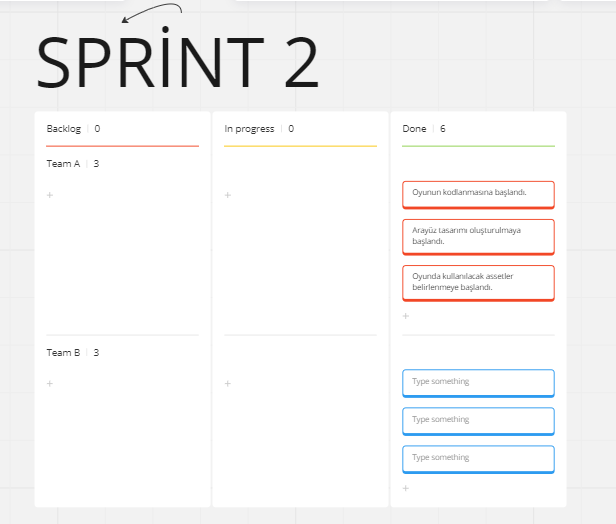
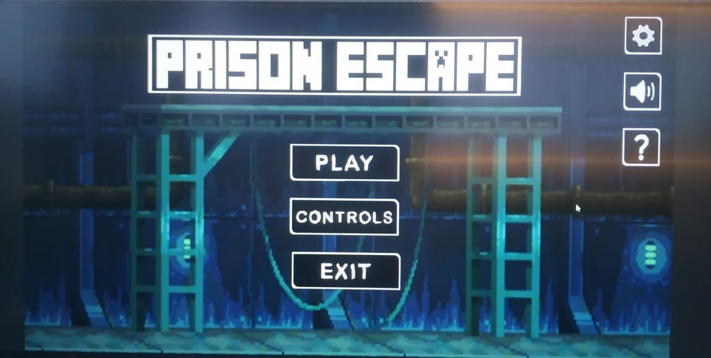
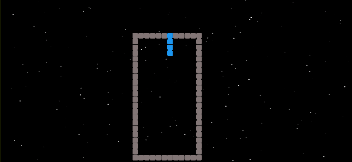

### 

<!--
**Akademitakim/Akademitakim** is a ✨ _special_ ✨ repository because its `README.md` (this file) appears on your GitHub profile.

Here are some ideas to get you started:

- 🔭 I’m currently working on ...
- 🌱 I’m currently learning ...
- 👯 I’m looking to collaborate on ...
- 🤔 I’m looking for help with ...
- 💬 Ask me about ...
- 📫 How to reach me: ...
- 😄 Pronouns: ...
- ⚡ Fun fact: ...
-->

<h2>
Takım İsmi</h2>

Escapists

<h3>
Ürün İle İlgili Bilgiler</h3>

<ul>
<h2>Takım Elemanları</h2>
<li>Berkay Ocak:Product Owner</li>
<li>Songül Çomoğlu:Scrum Master</li>
<li>Rojin Akbudak:Developer</li>
<li>Muhammet Ertuğrul Özer:Developer</li>
<li>Abdulkadir Akgül:Developer</li>
</ul>

<h2>
Ürün İsmi</h2>

<ul><li>Prison Escape</ul></li>

<h2>
Ürün Açıklaması</h2>

<ul><li>Hapishanede geçen, kendi özgürlüğün için doğru seçimler yapman gereken bir kart oyunu.</ul></li>

<h2>
Ürün Özellikleri</h2>

<ul>
<li>2D</li>
<li>Kart Oyunu</li>
<li>Diyalog Tabanlı</li>
<li>Rol Yapma</li></ul>

<h2>
Hedef Kitle</h2>

<ul><li>Herkes</li></ul>

<h2>
Product Backlog URL</h2> https://miro.com/app/board/uXjVMAc-x7c=/

<ul>
  <li> </ul></li>

<h1>SPRİNT 1</h1>

<ul>
<li><b>Sprint notları:</b>Tamamlanan ve tamamlanması gereken işler Done'ların içerisine eklenmiştir.İleride güncellenecektir. </li>  
<li><b>Sprint içinde tamamlanması tahmin edilen puan:</b>100 puan</li>
  <li><b>Puan tamamlama mantığı:</li></b>Toplamda proje boyunca tamamlanması gereken 340 puanlık backlog bulunmaktadır. 3 sprint'e bölündüğünde ilk sprint'in en azından 100 ile başlaması gerektiğine karar verildi.
  <li><b>Daily Scrum:</b> Daily Scrum toplantıları zamansal sıkıntılardan dolayı discord üzerinden sesli olarak yapılmıştır.</li></b>
  <li><b>Sprint board update:/</b>
</li>
  <li><b>Sprint Review:</b>Oyun içinde yer alacak hikaye kesinleşmiştir.Kullanılacak assetler hakkında birlikte araştırma yapılmıştır.</li>
   <li><b>Sprint Retrospective:</b>Takım içerisindeki roller kesinleştirilmiştir.Takım üyelerinin gelecek sprintlerde aktif olması gerektiğine vurgu yapılmıştır.</li>
  </ul>
  
<h1>SPRİNT 2</h1>

  <ul>
    <li><b>Sprint notları:</b>2.sprint için tamamlanması gereken görevler halledildi ve tabloya eklendi.</li> 
    <li><b>Sprint içinde tamamlanması tahmin edilen puan:</b>120 puan</li>
    <li><b>Puan tamamlama mantığı:</li></b>Toplamda proje boyunca tamamlanması gereken 340 puanlık backlog bulunmaktadır. 3 sprint'e bölündüğünde ikinci sprint'in 120 olması gerektiğine karar verildi.
     <li><b>Daily Scrum:</b> Daily Scrum toplantıları zamansal sıkıntılardan dolayı discord üzerinden sesli olarak yapılmıştır.</li>
    <li><b>Sprint board update:</li><b>
        <li><b>Ürün durumu:</li><b>
        <li><b>Sprint Review:</b>Hikaye akışı değiştirilmiştir.Yeni assetler eklenmiştir.Oyuna yeni bölümler eklenmiştir.</li>
   <li><b>Sprint Retrospective:</b>Takım üyelerinin gelecek sprintlerde aktif olması gerektiğine vurgu yapılmıştır.</li>
   <h2>
Product Backlog URL</h2> https://miro.com/app/board/uXjVMAc-x7c=/

   
<h1>SPRİNT 3</h1>

  <ul>
    <li><b>Sprint notları:</b>Son sprint için gereken görevler halledildi.</li> 
    <li><b>Sprint içinde tamamlanması tahmin edilen puan:</b>240</li>
    <li><b>Puan tamamlama mantığı:</li></b>İkinci sprintten kalan 120 puanın da eklenmesiyle bu sprint için toplam puan: 240'tır.
     <li><b>Daily Scrum:</b> Daily Scrum toplantıları zamansal sıkıntılardan dolayı discord üzerinden sesli olarak yapılmıştır.</li>
    <li><b>Sprint board update:</li><b>
        <li><b>Ürün durumu:</li><b>
        <li><b>Sprint Review:</b>Yapılacak oyun değiştirilmiştir.Tetris oyunu yapılmaya karar verilmiştir.Görevler dağıtıldı ve yapılmaya başlandı.</li>
   <li><b>Sprint Retrospective:</b>Takım üyelerinin gelecek sprintlerde aktif olması gerektiğine vurgu yapılmıştır.</li>
   <h2>
Product Backlog URL</h2> https://miro.com/app/board/uXjVMAc-x7c=/

   

      
    
     
    
  </ul>
